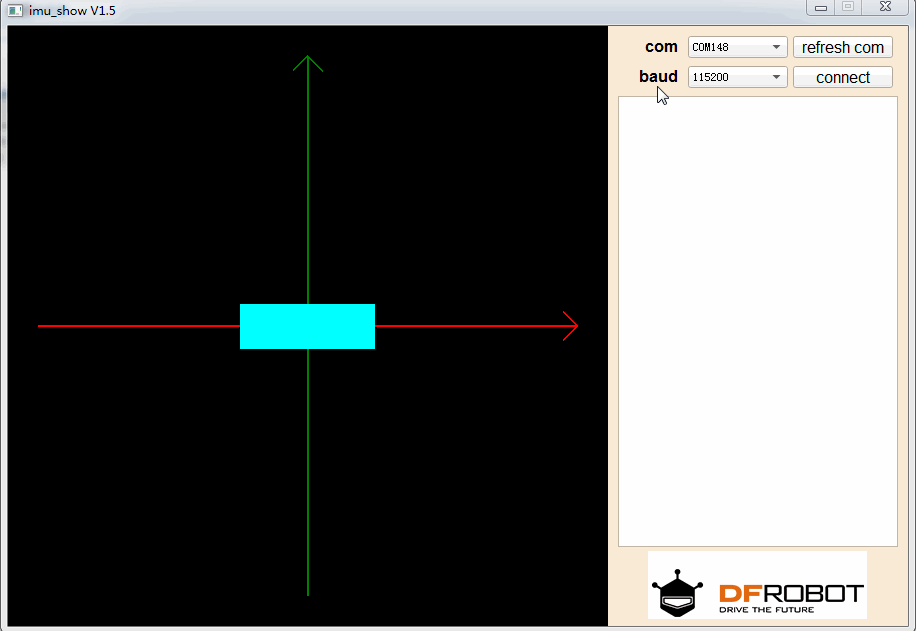

# DFRobot_IMU_Show

## usage

The textbox on the right of the interface will show the uploaded data.  
And the left  of the interface is a 3d cube.  
The top of the cube is red, the bottom is green, the left is blue, the right is yellow, the front is cyan, the back is pink.  
 
If the received data (attitude data) satisfies the following format:  
Pitch:xxx.xx roll:xxx.xx yaw:xxx.xx ...'\n'  
Example: pitch:32.12 roll:124.2145 yaw:1.057 '\n'  
 
Then the cube will be rotated in the data format 
